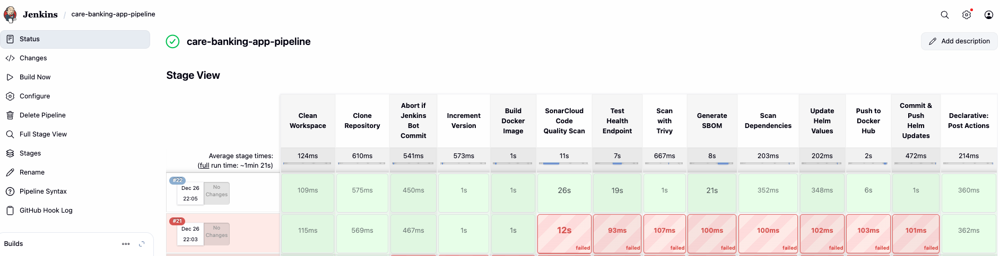
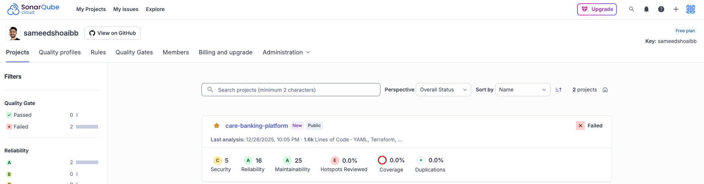
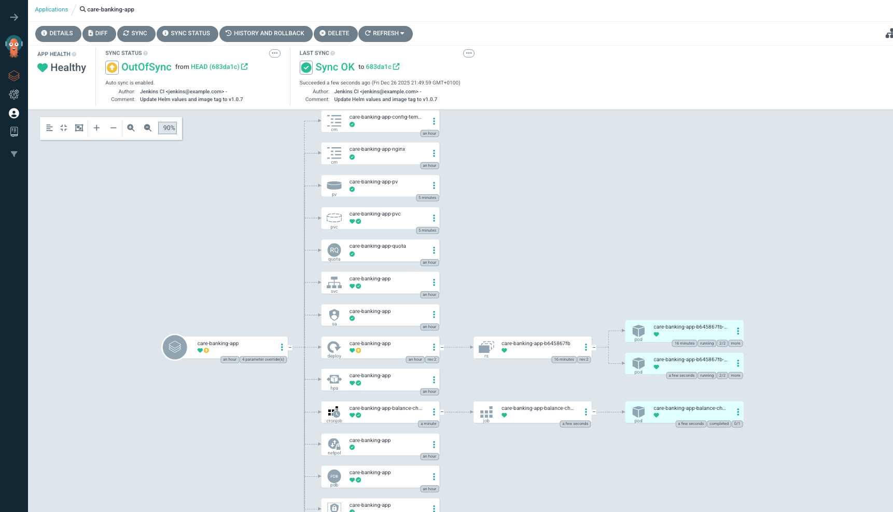

# Care Banking Platform

## Purpose

A complete DevOps setup that automates building, testing, and deploying a banking app to Kubernetes. Uses GitOps so deployments sync automatically from Git.

## What's Inside

### Platform Folder
Infrastructure setup for Kubernetes on a single VM.

- **Terraform** - Sets up cloud infrastructure on Azure (VM, networking, security)
- **Ansible** - Installs Docker, Kubernetes, Jenkins, and ArgoCD on the VM

### Care-Banking-App Folder
The application and its deployment config.

- **Source code** - Node.js/TypeScript app with 6 endpoints for account management
- **Helm charts** - Kubernetes manifests for dev, staging, and prod environments
- **Dockerfile** - Multi-stage build with security hardening
- **Jenkinsfile** - 13-stage CI/CD pipeline with security scans

## Project Workflow

**Prerequisites (One-time Setup):**
- Set up Docker Hub account and create access token
- Create Jenkins pipeline and configure secrets
- Add Docker Hub credentials in Jenkins
- Set up GitHub webhook to trigger Jenkins pipeline
- Connect ArgoCD to your Git repo
- Link ArgoCD to Kubernetes cluster

**Once setup is complete, the automated flow:**

1. **Developer pushes code to GitHub** 
2. **GitHub triggers Jenkins pipeline via webhook** 
3. **DevSecOps pipeline executes** - Builds Docker image, runs security tests, pushes to Docker Hub, updates deployment config
4. **ArgoCD detects configuration changes** - Automatically syncs to Kubernetes cluster
5. **App is live in ~5 minutes** 

**For detailed pipeline setup and configuration**, see the README files in `platform/` and `care-banking-app/` folders.

## Key Technologies

- **Terraform** - Azure infrastructure (VM, network, security)
- **Ansible** - Server setup and tool installation
- **Kubernetes** - Container orchestration (single node)
- **Docker** - Containerization
- **Helm** - Kubernetes deployment management
- **Jenkins** - CI/CD pipeline automation
- **ArgoCD** - GitOps deployment

## Getting Started

### Step 1: Terraform
Deploy infrastructure with Terraform:
- Ubuntu VM running in Azure 
- Virtual network with security rules configured
- Static public IP assigned to the VM

**For detailed instructions:** See `platform/terraform/README.md`

### Step 2: Configure Ansible
Edit `platform/ansible/inventory.ini` with your Terraform VM Public IP:
- VM public IP address (from terraform output)
- SSH key path

### Step 3: Run Ansible Playbook
From the `platform/ansible` folder, run:
```bash
ansible-playbook -i inventory.ini setup.yml
```

This will install and configure the VM:
- Harden VM with non-root user having sudo priviliges
- Docker container runtime
- Kubernetes single-node cluster via kubeadm
- Jenkins CI/CD server
- Helm package manager
- ArgoCD GitOps platform
- UFW firewall 

Takes about 10-15 minutes to complete.

**For detailed instructions:** See `platform/ansible/README.md`

### Step 4: Deploy the Banking App
Finish the setup by completing the Prerequisites section above first:
- Docker Hub account and credentials in Jenkins
- GitHub webhook for Jenkins
- ArgoCD linked to your Git repository and Kubernetes cluster

Push code changes to GitHub and it automatically builds and deploys.

**For detailed instructions:** See `care-banking-app/README.md`

## Detailed Documentation

Each folder contains its own README with complete details:

- **platform/terraform/README.md** - Infrastructure setup
- **platform/ansible/README.md** - What gets installed
- **care-banking-app/README.md** - Application deployment guide

Start with these README files for in-depth information about each component.

## CI/CD & Deployment Tools

**Jenkins** - Builds the app, runs security scans, pushes Docker image to Docker Hub, updates deployment config.



**SonarCloud** - Code quality and security analysis.



**ArgoCD** - Automatically syncs Git changes to Kubernetes.



## Project Structure

Read in this order: Terraform → Ansible → Care-Banking-App

```
care-banking-platform/
├── README.md
├── assets/
│   └── images/
│       ├── jenkins-pipeline.png
│       ├── sonarqube.png
│       └── argocd.png
│
├── platform/
│   ├── terraform/                    ← Start here: Creates cloud infrastructure
│   │   ├── README.md
│   │   ├── main.tf
│   │   ├── providers.tf
│   │   ├── variables.tf
│   │   ├── outputs.tf
│   │   ├── secrets.tfvars
│   │   ├── terraform.tfstate
│   │   ├── terraform.tfstate.backup
│   │   └── modules/
│   │       ├── azure-resource-group/
│   │       ├── azure-vnet/
│   │       ├── azure-vm/
│   │       └── azure-monitoring/
│   │
│   └── ansible/                      ← Then here: Configures the VM
│       ├── README.md
│       ├── ansible.cfg
│       ├── inventory.ini
│       ├── setup.yml
│       ├── requirements.yml
│       ├── group_vars/
│       │   └── all.yml
│       └── scripts/
│
└── care-banking-app/                 ← Finally: Deploy your application
    ├── README.md
    ├── Jenkinsfile
    ├── Dockerfile
    ├── config.json
    ├── package.json
    ├── pnpm-lock.yaml
    ├── tsconfig.json
    ├── deploy.sh
    ├── start.sh
    │
    ├── src/                          (Node.js/TypeScript source code)
    │   ├── index.ts
    │   ├── app.ts
    │   ├── config.ts
    │   ├── state.ts
    │   ├── adminRoutes.ts
    │   └── userRoutes.ts
    │
    └── helm/                         (Kubernetes deployment configs)
        ├── Chart.yaml
        ├── README.md
        ├── values.yaml
        ├── values.dev.yaml
        ├── values.staging.yaml
        ├── values.prod.yaml
        └── templates/
            ├── _helpers.tpl
            ├── configmap.yaml
            ├── deployment.yaml
            ├── ingress.yaml
            ├── secret.yaml
            ├── service.yaml
            ├── rbac/
            │   ├── role.yaml
            │   ├── rolebinding.yaml
            │   └── serviceaccount.yaml
            ├── storage/
            │   ├── pv.yaml
            │   └── pvc.yaml
            ├── policies/
            │   ├── networkpolicy.yaml
            │   ├── poddisruptionbudget.yaml
            │   └── resourcequota.yaml
            ├── advanced/
            │   ├── cronjob.yaml
            │   ├── hpa.yaml
            │   └── priorityclass.yaml
            ├── nginx/
            │   └── configmap-nginx.yaml
            └── tests/
                └── test-connection.yaml
```
