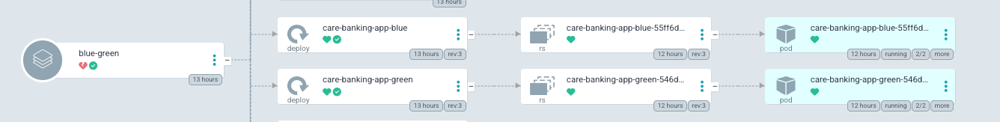
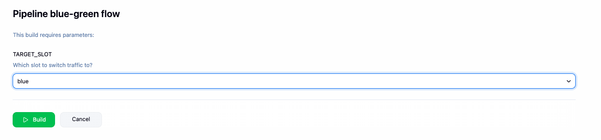
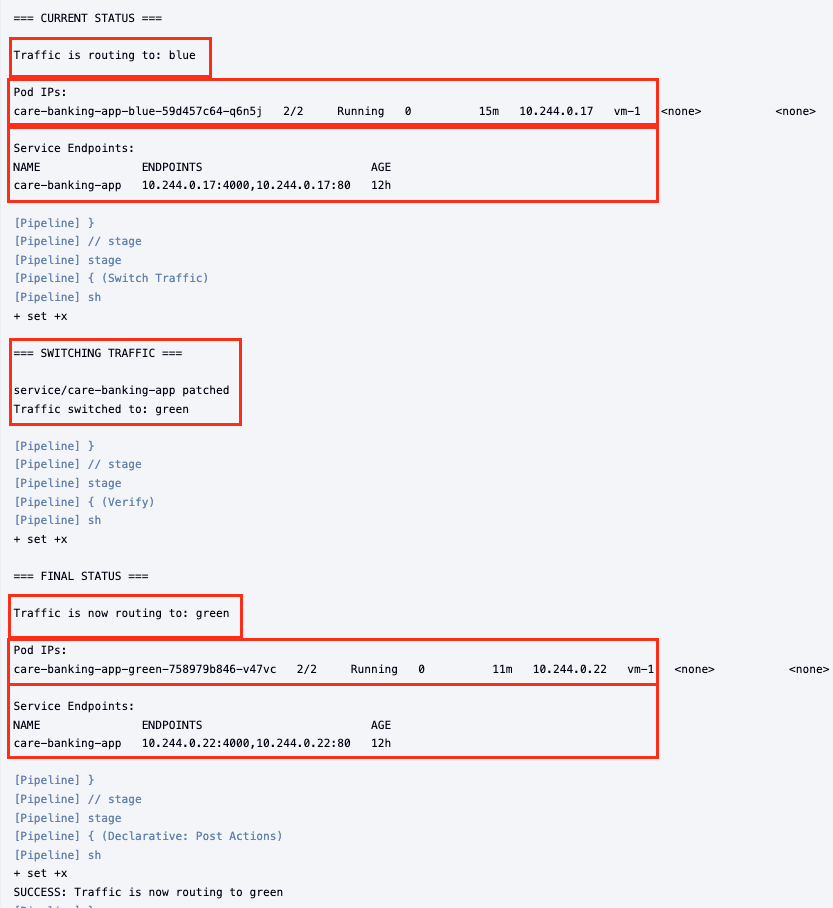

# Blue/Green Deployment: Zero-Downtime Release Pattern

## Why Blue/Green Deployment?

In a production environment, **zero downtime** deployment is critical. The blue/green deployment pattern solves this by running two identical instances simultaneously:

- **Blue Slot** = One version running (can be active or standby)
- **Green Slot** = Another version running (can be active or standby)
- **Only one receives traffic at a time** = The active slot

---

## How It Works: The Complete Deployment Cycle

**Starting Point:** Blue (v1.0.16) serves traffic, Green (v1.0.15) on standby

1. **Developer Pushes Code** - Changes pushed to main branch

2. **CI Pipeline Auto-Runs** - Builds image v1.0.17, runs security scans, compares versions (Green 1.0.15 < Blue 1.0.16), updates Green to v1.0.17, commits and pushes

3. **ArgoCD Syncs** - Detects change, renders templates, applies deployment, Green pod updates to v1.0.17

4. **Testing Phase** - Blue (v1.0.16) serving users, Green (v1.0.17) ready for testing

5. **Manual Traffic Switch** - Once verification of Green is complete, Run **Jenkinsfile-blue-green** job, select Green as an input, traffic redirects instantly to Green

6. **New State** - Green (v1.0.17) serves traffic, Blue (v1.0.16) on standby → Cycle repeats

---

## What Changed: Files Created & Modified

To implement the blue/green deployment pattern, the following files were newly created or modified:

### New Files:
1. **deployment-blue.yaml** - Kubernetes deployment for blue slot (v1.0.16)
   - Location: `care-banking-app/helm/templates/deployment-blue.yaml`

2. **deployment-green.yaml** - Kubernetes deployment for green slot (v1.0.15)
   - Location: `care-banking-app/helm/templates/deployment-green.yaml`
   
3. **Jenkinsfile-blue-green** - Jenkins job to manually switch traffic between slots
   - Location: `care-banking-app/Jenkinsfile-blue-green`

**Note**: Both deployments share the same service, ConfigMap, and secret resources. The difference lies in the image tags and the service selector.

### Modified Files:
1. **Jenkinsfile** - Added a logic to detect and update the lower version tag
   - Extracts blue and green versions from **values.prod.yaml**, compares them, update the lower one, commits and pushes to GitHub
   - Location: `care-banking-app/Jenkinsfile`

2. **values.prod.yaml** - Updated the file to store separate image tags for each slot
   - Added `blue.imageTag`, `green.imageTag` , `activeSlot` field to control which deployment receives traffic
   - Location: `care-banking-app/helm/values.prod.yaml`

3. **service.yaml** - Modified selector to route traffic based on activeSlot
   ```yaml
    slot: {{ .Values.activeSlot }}
    ```
   - Location: `care-banking-app/helm/templates/service.yaml`

---

## Detailed Implementation

### 1. Modified Deployment Configuration

The application now runs two independent Kubernetes deployments instead of one:

- **deployment-blue.yaml**: Blue slot deployment (e.g., v1.0.16)
- **deployment-green.yaml**: Green slot deployment (e.g., v1.0.15)
- **service.yaml**: Routes traffic based on activeSlot selector value

### 2. Values Configuration for Environment-Specific Versions

Production environment now tracks two image versions in `values.prod.yaml`:

```yaml
app:
  image: sameedshoaib1/care-banking-app
  imagePullPolicy: IfNotPresent

blue:
  imageTag: v1.0.16      # Blue slot version

green:
  imageTag: v1.0.15      # Green slot version

activeSlot: blue        # Which slot currently serves traffic
```

### 3. Jenkinsfile Enhancement

When you push code, Jenkins automatically decides which slot needs the update. Here's what it does:

1. Looks at what version is running in blue and green
2. Figures out which one is older
3. Builds the new Docker image
4. Updates the older slot to the new version
5. Saves this change back to GitHub

**Why Update the Older Slot?** This way, new code always goes to the standby slot, production users keep using the stable version. We test the new code first, then switch traffic when we are confident it works.


[ *This diagram shows the CI pipeline updating the lower version tag.* ]

### 4. ArgoCD Automatic Sync

When Jenkins commits the updated `values.prod.yaml` from step 3, ArgoCD detects the change and:

1. Applies the deployment YAML to Kubernetes
2. The inactive slot's deployment updates with new image tag
3. Kubernetes pulls the new image and creates new pods
4. Both versions now run: one active (serving traffic), one testing



### 5. Manual Traffic Switching with Jenkinsfile-blue-green

When you want to activate the new version after testing, run the traffic Jenkins-blue-green job. The process follows these stages:

**Step 1: Trigger the Pipeline**

[ *Select the target slot for traffic switching.* ]

**Step 2: Pipeline Status**

[ *Updates the service selector to route all traffic to the target slot.* ]

**Step 3: Verify the Traffic Switch**


[ *Confirms the traffic switch was successful and shows the new active slot details.* ]

The service selector updates instantly, routing all traffic to the selected slot without any pod restarts.

---

## Files Structure

```
care-banking-app/
├── Jenkinsfile                              # Updated: Auto-update lower version
├── helm/
│   ├── values.prod.yaml                     # Updated: blue + green tags
│   └── templates/
│       ├── deployment-blue.yaml             # New: Blue slot deployment
│       ├── deployment-green.yaml            # New: Green slot deployment
│       ├── service.yaml                     # Updated: activeSlot selector
│       ├── Jenkinsfile-blue-green           # New: Manual traffic switch
│       └── blue-green-deployment/           # Documentation
│           ├── README.md                    # This file
│           └── images/                      # Flow diagrams
```

---